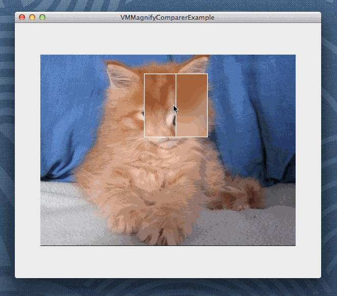

# VMMagnifyComparer
A magnified comparison between two images.

## Demo

As you can see, `VMMagnifyComparerView` is very useful if you want to compare two images in detail.

<b>Note</b>: The mouse cursor is drawn only for this demo. If you run the example project by yourself, you wouldn't see the mouse cursor.

## Setup
Copy files from `VMMagnifyComparer` folder to your own project.

## APIs
`VMMagnifyComparerView` is essentially a `NSImageView`, so you can set current display image with `setImage:` call.

To set the image to compare with, use `setDuelImage:`.

To set the size of `VMMagnifiyComparerView`, use `setMagnifierSizeRatio:`. Note this ratio is calculated as `smallerSideOf(imageView.frame) / smallerSizeOf(magnifier.frame)`, so it's greater or equal to 1.

Finally, you can set a border image with `setSegImage:`. Since the size of `VMMagnifyComparerView` varies with raw image size, you'd better use vector images here.

For more detail, please check the example project.

## License
Check out [LICENSE](./LICENSE).
